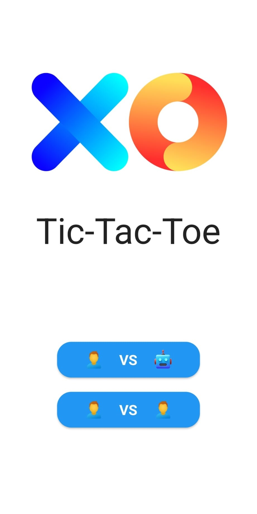
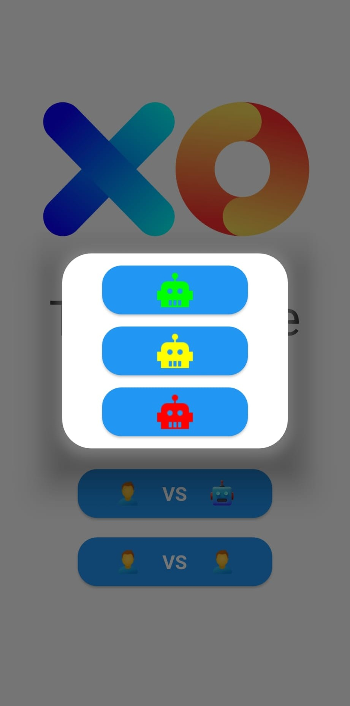
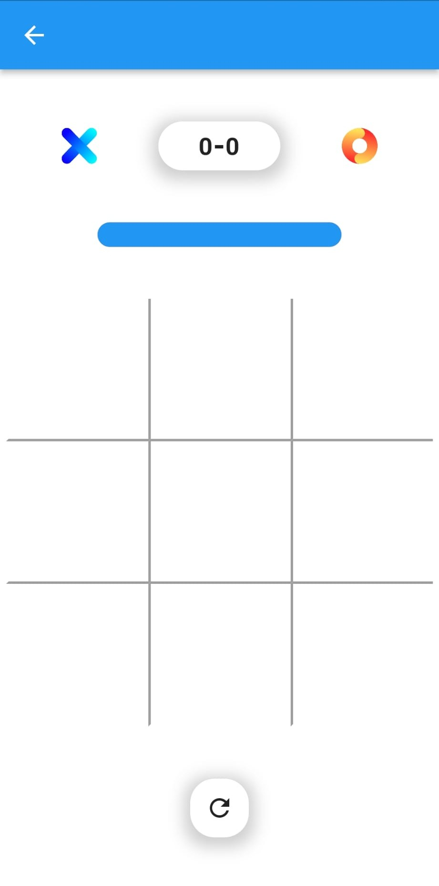
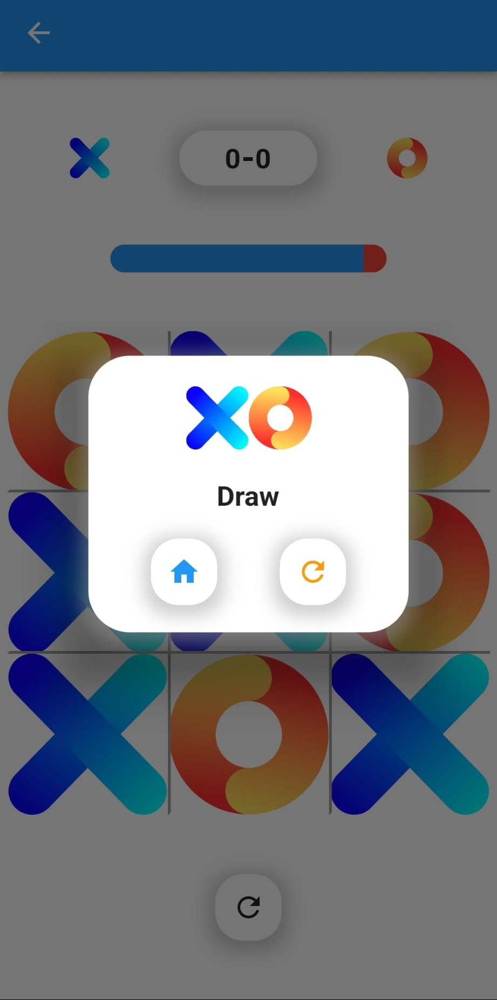

# 🟢 Tic-Tac-Toe App

A beautifully designed, feature-rich Tic-Tac-Toe game built with **Dart** and **Flutter**.

## ✨ Overview

This app allows you to enjoy the classic Tic-Tac-Toe game with a modern twist! You can challenge a friend or test your skills against a computer opponent at different difficulty levels. The clean and intuitive interface makes it engaging and fun to play.

## 🏠 Main Menu

When you open the app, you're greeted with a sleek main screen (see Image 1):

- **Play vs Computer 🤖:** Play against an AI opponent.
- **Play vs Human 👤:** Play against another human player locally.

## 🤖 Difficulty Levels

If you choose to play against the computer, a difficulty selection menu pops up (see Image 2):

- **Easy (Green robot):** Suitable for beginners.
- **Medium (Yellow robot):** A moderate challenge.
- **Hard (Red robot):** A tough opponent for experienced players.

## 🎮 Game Board

On the game screen (see Image 3), you’ll find:

- A **score tracker** at the top, showing the current score for each player.
- A **timer bar** below the score that resets after each move. If the timer runs out, the player whose turn it is loses automatically.
- The classic **3x3 grid** for making moves.
- A **restart button** at the bottom to reset the board and start a new game.

## 🏁 Game Over Screen

When a game ends (see Image 4):

- A modal shows the result (win, loss, or draw).
- You can choose to **return to the main menu** (🏠) or **restart the game** (🔄) directly.

## ⚙️ Features

- Smooth animations and intuitive UI.
- Multiple difficulty levels to challenge your skills.
- Timer feature adds a strategic twist.
- Score tracking for continuous play.
- Restart and home navigation buttons for ease of use.

## 🛠️ Tech Stack

- **Language:** Dart
- **Framework:** Flutter

